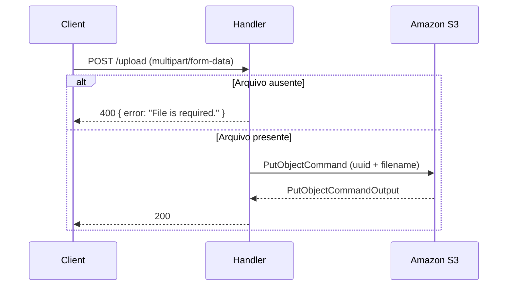
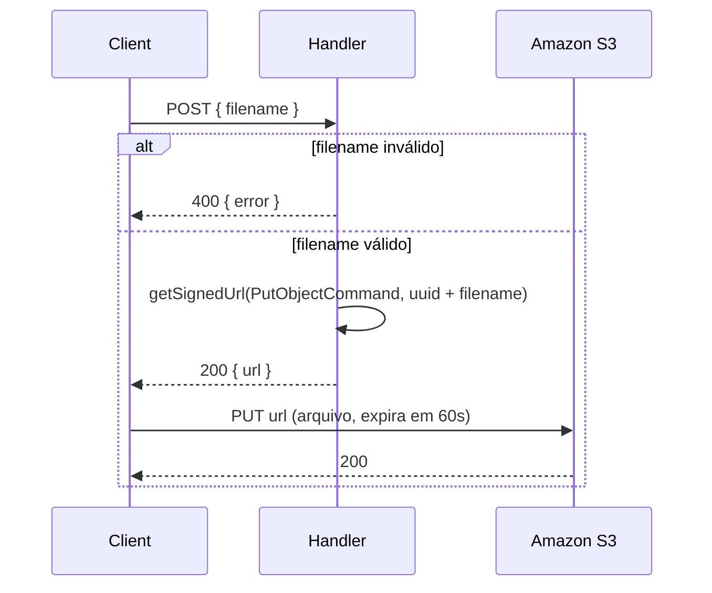

# AWS Lambda Uploader

Função AWS Lambda que recebe um arquivo via `multipart/form-data` e o armazena em um bucket do Amazon S3, retornando a resposta da operação de upload.


## Stack

| Categoria              | Tecnologia              | Versão |
|------------------------|-------------------------|--------|
| Runtime                | Node.js                 | 24     |
| Linguagem              | TypeScript              | 7      |
| Plataforma             | AWS Lambda              | —      |
| Armazenamento          | Amazon S3               | —      |
| SDK AWS                | @aws-sdk/client-s3      | 3      |
| Parser de upload       | lambda-multipart-parser | 1      |
| Bundler                | tsup                    | 8      |
| Formatação / Lint      | Biome                   | 2      |
| Gerenciador de pacotes | pnpm                    | latest |

## Fluxo — upload direto (`uploader`)

O arquivo trafega pela Lambda: o cliente envia o arquivo via `multipart/form-data` e o handler faz o `PutObject` no S3.



## Fluxo — presigned URL (`presigned`)

O arquivo **não** trafega pela Lambda: o cliente pede uma URL assinada informando apenas o `filename`, e faz o upload direto para o S3 com essa URL. A URL assinada expira em **60 segundos**.



## Variáveis de ambiente

```env
BUCKET_NAME=nome-do-seu-bucket
BUCKET_REGION=us-east-1
```

## Uso

```bash
pnpm install
pnpm build
```
