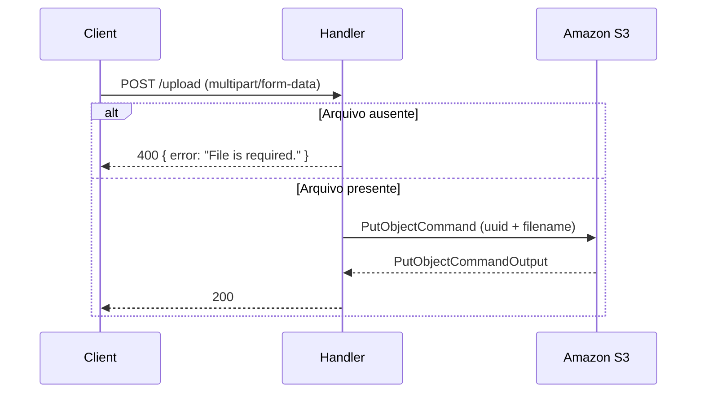
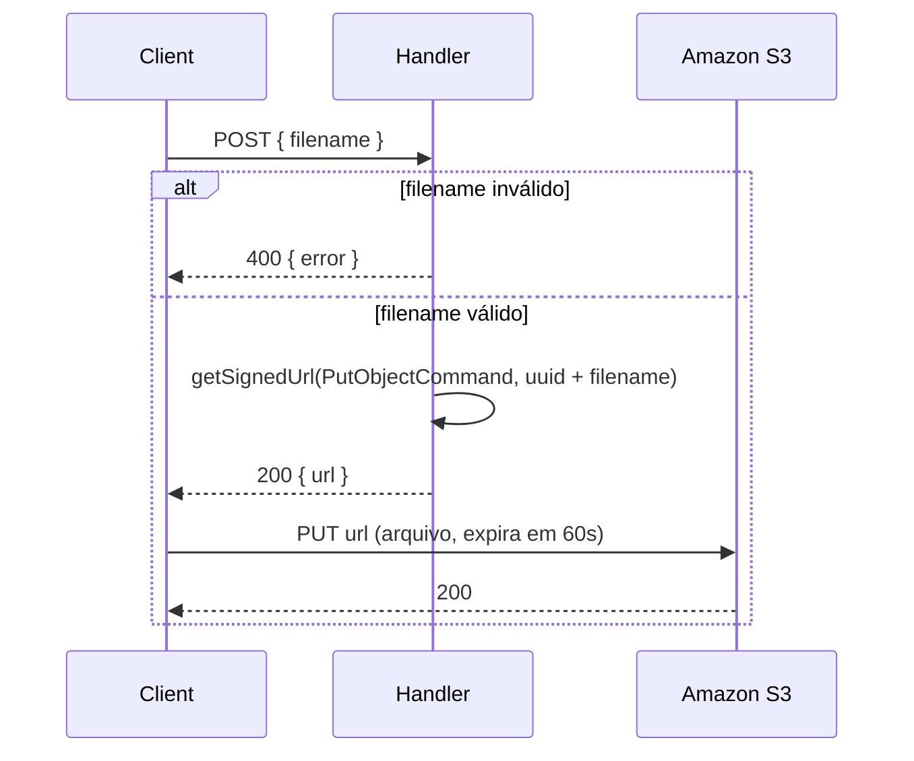
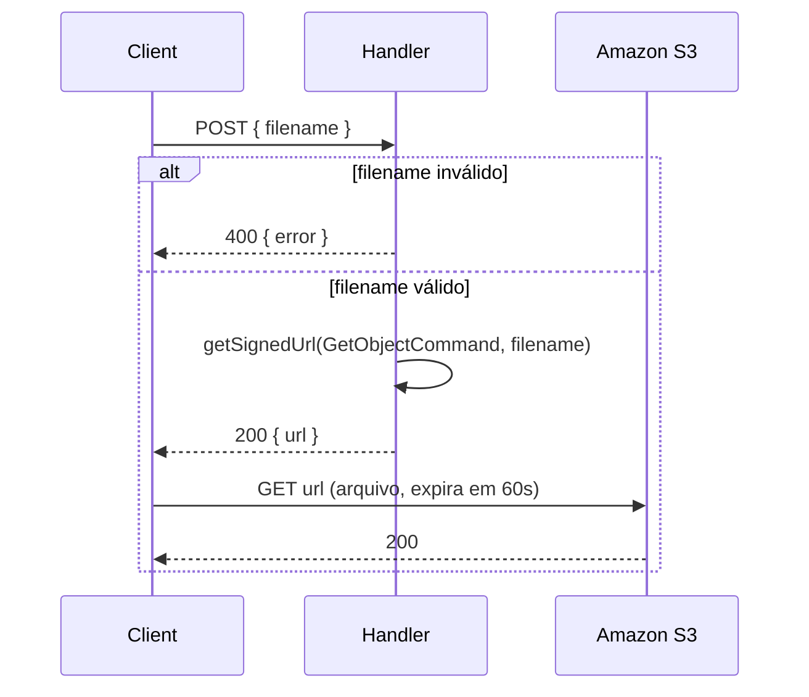

# AWS Lambda Uploader

Coleção de funções AWS Lambda para upload e download de arquivos no Amazon S3. Inclui três estratégias: upload direto via `multipart/form-data` e geração de URLs assinadas (presigned URLs) para upload e download diretos no S3, sem tráfego pela Lambda.


## Stack

| Categoria              | Tecnologia                     | Versão |
|------------------------|--------------------------------|--------|
| Runtime                | Node.js                        | 24     |
| Linguagem              | TypeScript                     | 7      |
| Plataforma             | AWS Lambda                     | —      |
| Armazenamento          | Amazon S3                      | —      |
| SDK AWS                | @aws-sdk/client-s3             | 3      |
| Presigned URLs         | @aws-sdk/s3-request-presigner  | 3      |
| Parser de upload       | lambda-multipart-parser        | 1      |
| Validação              | zod                            | 4      |
| Bundler                | tsup                           | 8      |
| Formatação / Lint      | Biome                          | 2      |
| Gerenciador de pacotes | pnpm (workspace)               | latest |

## Funções

| Função          | Diretório       | Responsabilidade                                              |
|-----------------|-----------------|--------------------------------------------------------------|
| `conventional`  | `conventional/` | Upload direto do arquivo via `multipart/form-data`.          |
| `presigned`     | `presigned/`    | Gera URL assinada para **upload** direto no S3 (`PutObject`). |
| `get-presigned` | `get-presigned/`| Gera URL assinada para **download** direto do S3 (`GetObject`). |

## Fluxo — upload direto (`conventional`)

O arquivo trafega pela Lambda: o cliente envia o arquivo via `multipart/form-data` e o handler faz o `PutObject` no S3.



## Fluxo — presigned URL de upload (`presigned`)

O arquivo **não** trafega pela Lambda: o cliente pede uma URL assinada informando apenas o `filename`, e faz o upload direto para o S3 com essa URL. A URL assinada expira em **60 segundos**.



## Fluxo — presigned URL de download (`get-presigned`)

O cliente pede uma URL assinada informando o `filename` da chave desejada e faz o download direto do S3 com essa URL. A URL assinada expira em **60 segundos**.



## Variáveis de ambiente

Cada função tem seu próprio `.env` (veja o `.env.example` em cada diretório):

```env
BUCKET_NAME=nome-do-seu-bucket
BUCKET_REGION=us-east-1
```

## Uso

```bash
pnpm install

# build por função
pnpm build:conventional
pnpm build:presigned
pnpm build:get-presigned
```
